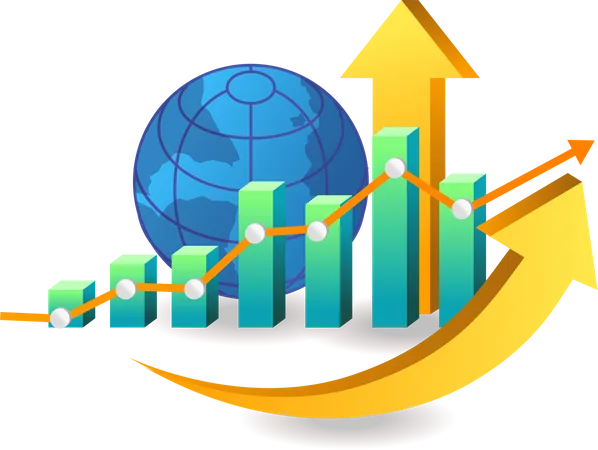
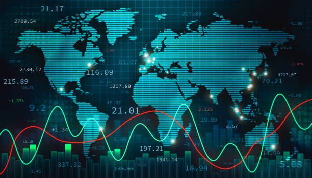

# 🌍 Global Economic Indicators Dashboard 

Welcome to the Global Economic Indicators Dashboard! This dashboard provides a comparative analysis of various economic, demographic, and social indicators across multiple countries from 1999 to 2025. 📊

.gif)
## Features

- **User-Friendly Interface**: Easily select countries and years to visualize data.
- **Comparative Analysis**: Side-by-side comparison of key indicators across countries.
- **Technical Analysis**: 
  - **Trend Lines**: Visualize economic indicators over time.
  - **Moving Averages**: Analyze trends in inflation, GDP growth, and unemployment.
  - **Correlation Analysis**: Explore relationships between indicators like inflation and unemployment.
- **Export Options**: Export charts and data for further analysis and reporting. 🚀

## Key Indicators

### Economic Indicators
- **GDP Growth**: Measures the economic performance and growth rate of a country over time.
- **Inflation**: Understand the rate at which the general level of prices for goods and services is rising.
- **Unemployment**: Analyzes the percentage of the labor force that is jobless and seeking employment.
- **Government Debt to GDP**: Evaluates the government's debt as a percentage of its Gross Domestic Product.
- **Current Account Balance**: Observes the balance of exports and imports of goods, services, and transfer payments.
- **Foreign Direct Investment**: Tracks investments made by foreign entities in the domestic economy.
- **Consumer Price Index**: Monitors changes in the price level of a basket of consumer goods and services.

### Demographic Indicators
- **Population Growth**: Tracks the increase in the number of individuals in a population.
- **Life Expectancy**: Measures the average period that a person may expect to live.
- **Poverty Rate**: Understand the percentage of the population living below the poverty line.
- **Literacy Rate**: Gauges the percentage of people who can read and write.

### Social Indicators
- **Gini Coefficient**: Analyzes income inequality within a country.
- **Labor Force Participation**: Monitors the percentage of the working-age population that is part of the labor force.

## Global GDP Growth Map
- **Interactive Map**: Shows the GDP growth rates across different countries.
- **Year Range Selection**: Select a range of years to visualize GDP growth over time.

## How to Run the Dashboard

1. **Clone the Repository**:
    ```sh
    git clone https://github.com/yourusername/economic-dashboard.git
    cd economic-dashboard
    ```

2. **Install Dependencies**:
    ```sh
    pip install -r requirements.txt
    ```

3. **Run the Dashboard**:
    ```sh
    streamlit run app.py
    ```

## Data Sources
- **World Bank**
- **International Monetary Fund (IMF)**

## Creator
- **Irfan Ali Khan**: [LinkedIn](https://www.linkedin.com/in/irfan-ali-khan-93b52b159/)

## License
This project is licensed under the MIT License - see the LICENSE file for details.

## Contributing
Contributions are welcome! Please read the CONTRIBUTING guidelines first.

## Acknowledgements
- Thanks to the World Bank and IMF for providing the data.
- Special thanks to the open-source community for their invaluable tools and libraries.

## Screenshots




## Contact
For any inquiries, please contact [Irfan Ali Khan](https://www.linkedin.com/in/irfan-ali-khan-93b52b159/).

---

Enjoy exploring the global economic indicators! 🌍📊🚀
